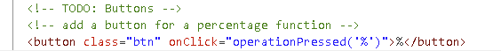
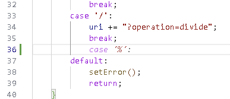
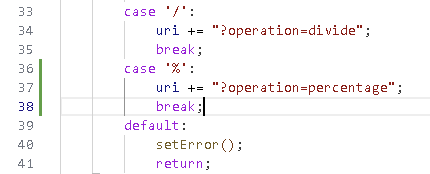

## Workshop exercises

### Core exercise

The following exercises will help you get started with GitHub Copilot. You must have completed the [setup instructions](<./1. setup.md>) before starting these steps.


### Step by step instructions

<details>
<summary>1. Getting the application running</summary>

**Starting Point**: You should have the repo open in VSCode (or your supported IDE)

1. Press ```CTRL + ` ``` to open the terminal window in VS Code if it is not already open.

2. Enter ```npm install``` in the terminal window and press **ENTER** to install the required dependencies.

Let's start by running the application to learn what it does.

3. Enter ```npm run dev``` in the terminal window and press **ENTER** to run the application.

4. In Codespaces, open the forwarded port for `3000` when prompted. If you are running locally, open `http://localhost:3000` in your browser.


5. Do some simple calculations to show that the calculator is working as expected.


6. Close the browser tab for now and return to VS Code.

7. Ensure your focus is in the terminal window and press ``` CTRL + C ``` to stop the application.

</details>

<details>
<summary>2. Adding features using GitHub Copilot</summary>

You've been asked to add a new feature to the calculator application.

### Adding the buttons to the calculator UI

1. Open the ```public/index.html``` file in the editor window.

2. Scroll to the keypad button list inside `<div class="calculator-buttons">`.

3. Add a new line after the `=` button and type the following two lines. You should see GitHub Copilot start to autocomplete the second line as you type. Press ```TAB``` to accept the completion.

``` <!-- add a button for a percentage function --> ```
``` <button class="btn" onClick="operationPressed('%')">%</button> ```

Your finished snippet should match the following. If not, ask Copilot Chat to revise the line by specifying the function name `operationPressed`.



### Adding the logic for the new features

5. Open the ```api/controller.js``` file in the editor window.

6. Locate the `operations` object.

7. Press **ENTER** at the end of the line that defines the divide function.

8. Start typing the following line and notice that GitHub Copilot should start to offer code completion half way through the word "percentage" as you're typing. Press **TAB** to accept the suggestion.

```'percentage': function(a, b) { return (Number(a) / 100) * Number(b) },```

9. Open the ```public/client.js``` file in the editor window.

10. Locate the `switch (operation)` block in `calculate`.

11. Move your cursor to the end of the line 35 (to the right of ```break;``` and press **ENTER**.

GitHub Copilot should display ghost text suggesting the code shown in the following screenshot. Press **TAB** to accept the suggestion.



12. Press **ENTER** at the end of the line, then accept the next two lines Copilot suggests.

Your completed addition should match the following.



13. Press ```CTRL + ` ``` to open the terminal window in VS Code.

14. Enter ```npm run dev``` in the terminal window and press **ENTER** to run the application.

15. Test the new button by clicking 5, then `%`, then 10, and finally `=`. The expected result is `0.5`.

16. Close the browser window, return to the Terminal window in Codespaces and press ```CTRL+C``` to terminate the application.

**Success**, you have enhanced the calculator application using GitHub Copilot!

</details>


---

> Copilot suggestions are probabilistic, so your generated code may differ from screenshots. If needed, ask Copilot Chat to explain or revise the generated snippet before accepting it.


#### What's next?
You're now ready to start the [challenge exercises](<./3. challenge exercises.md>) to see how you can leverage the power of GitHub Copilot to solve a number of challenges yourself.
